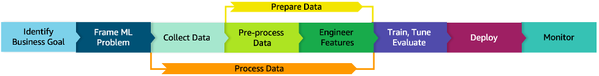

# MLOPS R5

Contando con que los recursos son ilimitados escogería trabajar con Amazon SageMaker ya que es un servicio dedicado a automatizar y estandarizar procesos en todo el ciclo desarrollo y producción de Machine Learning, este servicio puede entrenar, probar, solucionar, desplegar y gestionar modelos de ML a escala de forma sencilla.

Antes de llevar a producción cualquier proyecto de ML debemos tener en cuenta los siguientes pasos. 

*__Identificacion de problema de negocio:__* es la fase más importante de un proyecto de ML. En esta fase, debe definir claramente el problema que está tratando de resolver y el valor comercial que se espera lograr ademas se debe determinar si ML es el enfoque correcto para su problema y si tiene suficientes datos para entrenar un modelo preciso.

*__Enmarcado del problema:__*  En esta fase se define la metodología con la cual se va abordar el problema de negocio mediante técnicas de ML. También se determina qué observar y qué se debe predecir (variable objetivo). Además, se Identifican qué predecir y cómo optimizar el rendimiento con diferentes métricas de rendimiento.

*__Procesamiento y preparación de datos:__* En este paso, los científicos de datos/ingenieros de datos recopilan datos, los integran con diferentes fuentes y los limpian y transforman para que estén listos para su consumo. Los ingenieros/científicos de datos también pueden dividir los datos en tres conjuntos: entrenamiento, validación y prueba. Los conjuntos de entrenamiento se utilizan directamente para entrenar el modelo, los conjuntos de validación son ejemplos no vistos que se utilizan para evaluar el rendimiento del modelo, y los conjuntos de prueba son otro conjunto de registros no vistos que se utilizan para verificar el rendimiento del modelo en situaciones reales.

