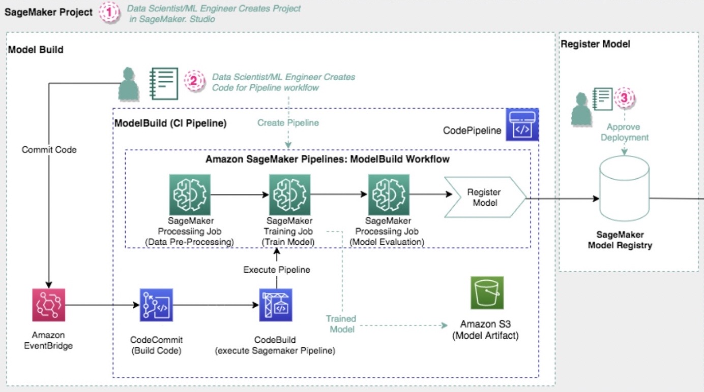
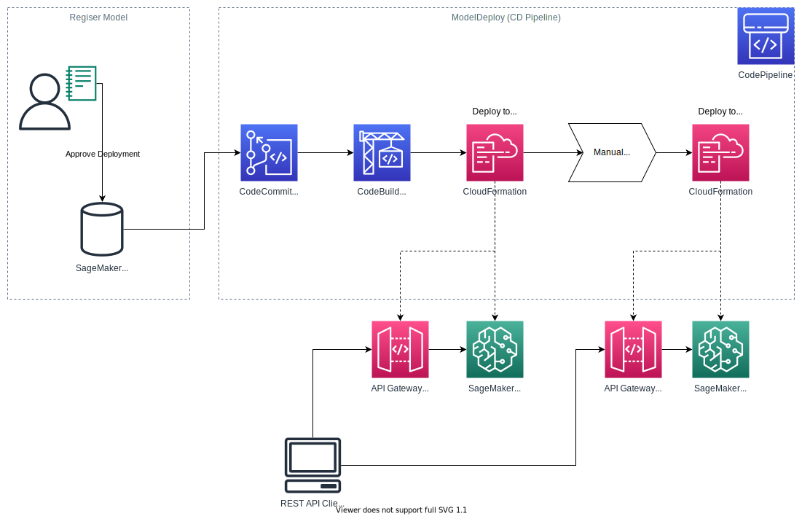
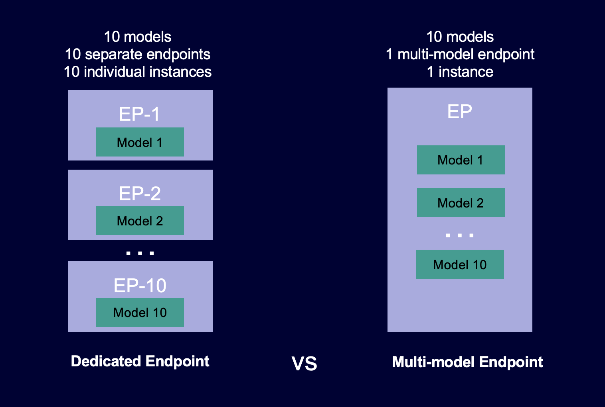

# MLOPS R5

Contando con que los recursos son ilimitados escogería trabajar con Amazon SageMaker ya que es un servicio dedicado a automatizar y estandarizar procesos en todo el ciclo desarrollo y producción de Machine Learning, este servicio puede entrenar, probar, solucionar, desplegar y gestionar modelos de ML a escala de forma sencilla.

Antes de llevar a producción cualquier proyecto de ML debemos tener en cuenta los siguientes pasos. 

*__Identificacion de problema de negocio:__* es la fase más importante de un proyecto de ML. En esta fase, debe definir claramente el problema que está tratando de resolver y el valor comercial que se espera lograr ademas se debe determinar si ML es el enfoque correcto para su problema y si tiene suficientes datos para entrenar un modelo preciso.

*__Enmarcado del problema:__*  En esta fase se define la metodología con la cual se va abordar el problema de negocio mediante técnicas de ML. También se determina qué observar y qué se debe predecir (variable objetivo). Además, se Identifican qué predecir y cómo optimizar el rendimiento con diferentes métricas de rendimiento.

*__Procesamiento y preparación de datos:__* En este paso, los científicos de datos/ingenieros de datos recopilan datos, los integran con diferentes fuentes y los limpian y transforman para que estén listos para su consumo. Los ingenieros/científicos de datos también pueden dividir los datos en tres conjuntos: entrenamiento, validación y prueba. Los conjuntos de entrenamiento se utilizan directamente para entrenar el modelo, los conjuntos de validación son ejemplos no vistos que se utilizan para evaluar el rendimiento del modelo, y los conjuntos de prueba son otro conjunto de registros no vistos que se utilizan para verificar el rendimiento del modelo en situaciones reales.

*__Entramiento y tuneo del modelo:__* En esta fase, seleccionas un algoritmo adecuado para el problema y luego se entrenas el modelo con datos de entrenamiento, se establece una métrica objetivo para el modelo, con el fin de  optimizar y configurar los hiperparámetros para obtener el mejor rendimiento del modelo y evitar problemas como el sobre ajuste.

*__Evaluación del modelo:__* Una vez que se haya completado el entrenamiento del modelo, es necesario evaluar su rendimiento y precisión. Es recomendable generar varios modelos utilizando diferentes métodos y luego evaluar la efectividad de cada uno. El modelo entrenado se evalúa utilizando una porción del conjunto de datos que se ha reservado como conjunto de validación. En función de los resultados de la evaluación, es posible realizar ajustes en los datos, el algoritmo o en ambos aspectos.

*__Implementación y monitoreo:__* Después de entrenar, ajustar y evaluar su modelo, puede implementarlo en producción y realizar predicciones e inferencias. En la implementación del modelo de ML se definen los activos de ML, como el modelo, sus parámetros e hiperparámetros, los scripts de entrenamiento y los datos de entrenamiento y prueba. Se presta especial atención a la identidad, los componentes, el control de versiones y las dependencias de estos artefactos de ML. El objetivo final es desplegar estos artefactos en forma de servicios o componentes de infraestructura.
En este paso se deben abarcar prácticas como la integración continua (CI) para agregar datos y modelos de prueba y validación, la entrega continua (CD) para automatizar la implementación de modelos en servicios de predicción, la capacitación continua (CT) que permite el reentrenamiento automático de los modelos y la monitorización continua (CM) para supervisar los datos de producción y las métricas de rendimiento del modelo.
Una vez implementado el modelo de ML, es crucial monitorear su rendimiento para asegurar su comportamiento esperado. Esto implica supervisar los cambios de dependencia, datos, y la estabilidad numérica del modelo. También se debe monitorear el rendimiento computacional del sistema de ML, los procesos de generación de características y la degradación de la calidad predictiva en los datos. 

__Posible sistema para poner en producción y monitorear los diferentes modelos__

como se aprecia en la imagen un sistema de MLOPS consta de varios pasos, comenzando con la recopilación de datos de diversas fuentes, seguida de la preparación de los datos para su uso en el entrenamiento del modelo. Una vez preparados, se procede al entrenamiento del modelo utilizando algoritmos que aprenden de los datos y generan un modelo. Después, se evalúa el rendimiento del modelo utilizando nuevos datos para comprobar su capacidad de predicción. Una vez que el modelo ha sido evaluado, se implementa para su uso en producción, lo que implica empaquetarlo y hacerlo accesible a los usuarios. Este proceso puede estar propenso a errores. Sin embargo, la entrega continua y la automatización pueden mejorar este proceso al automatizar los pasos de todo el sistema, permitiendo una implementación más rápida y confiable de nuevos modelos. Esto ayuda a reducir errores y mejorar la eficiencia general del sistema de ML.

## __MLOPS Con AWS Y SageMaker__

Teniendo en cuenta los requeremientos del problema nos vamos a enforcar en el proceso de productivizar y monitorear estos modelos para la inferencia en tiempo real.

Los pasos necesarios para crear e implementar un modelo de ML los vamos a realizar con  Amazon SageMaker.

Los pipelines de SageMaker son el primer servicio de integración y entrega continuas (CI/CD) especialmente diseñado para ML.

un pipeline para ML esta compuesto de esta manera:

los sistemas de MLOPS tienen dos grandes componentes uno de construcción y uno de implementación.

A continuación vemos un diagrama necesarios para generar el componente de la construcción:

En este componente se dan los procesos de preparación de datos, entrenamiento de modelos y evaluación del modelo, luego se guarda el mejor modelo entrenado en un bucket de S3 y en el registro de modelos de SageMaker.  para usarlo en la etapa de implementación. 

Todo el codigo se obtiene de un repositorio de CodeCommit donde se almacena el código fuente del pipeline el cual tiene scripts predinifdos ejecutados en python.

Despues en el componente de la implementacion se tienen los siguente pasos:

Se obtiene el modelo registrado y guardado ya que es el modelo disponible para su uso en producción.

para la inferencia en tiempo real. Esta plantilla reconoce cambios en el registro del modelo. Cuando se registra y aprueba una nueva versión del modelo, se inicia automáticamente una implementación.

La plantilla aprovisiona un repositorio de CodeCommit con archivos de configuración para especificar los pasos de implementación del modelo, plantillas de AWS CloudFormation para definir puntos de enlace como infraestructura y código fuente para probar el punto de enlace.

Uniendo los dos componentes tenemos el siguiente diagrama que ilustra el proceso y la arquitectura para el sistema de MLOPS.

Para productivizar y monitorear estos modelos planteó un pipeline que sirve para la compilación, entrenamiento e implementación de modelos de aprendizaje automático en Amazon SageMaker.

Con lleva los siguientes pasos: 

-	Preparación de datos: los datos se preparan para el entrenamiento del modelo limpiándolos y transformándolos. Esto incluye tareas como la eliminación de valores atípicos, la imputación de valores faltantes y la normalización de los datos.
-	Entrenamiento de modelos: un modelo se entrena utilizando los datos preparados. El modelo puede ser un modelo de regresión lineal simple o un modelo complejo de aprendizaje profundo.
-	Evaluación del modelo: el modelo entrenado se evalúa para evaluar su rendimiento. Esto se hace alimentando el modelo con nuevos datos y viendo qué tan bien predice el resultado.
-	Implementación del modelo: el modelo entrenado se implementa en producción para que pueda usarse para hacer predicciones.

Los servicios de AWS que se utilizan en el Pipeline son:

- AWS S3: se utiliza para almacenar artefactos, incluidos los artefactos de CodePipeline y CodeBuild, modelo final , y cualquier artefacto generado a partir del pipeline de SageMaker.

- AWS SageMaker: es el servicio se utiliza para crear, entrenar e implementar el modelo.

- AWS CloudWatch: CloudWatch se utiliza para monitorear el pipeline y el modelo.

- AWS CodeCommit: es un repositorio que se utiliza para almacenar el código fuente para la generacion del pipeline, ademas contiene código de muestra que implementa modelos en puntos de enlace en entornos de preparación y producción.

- AWS CodePipeline: contiene los codigos en python necesarios para generar los pasos de origen, compilación, implementación en preparación y producción.

Hay varios pasos de aprobación manual entre los pasos de preparación y producción, ya que generalmente hay cambios de versiones de librerias o en las fuentes de datos por lo que un ingeniero de MLOps debe aprobar el modelo antes de implementarlo en producción.

Además, en el pipeline las opciones de personalización incluyen:

El tipo de modelo que se entrena.
Los hiperparámetros que se utilizan para entrenar el modelo.
Las métricas que se utilizan para evaluar el modelo.
La configuración de implementación.

## Codigo practico para hacer y entender pipelines en SageMaker

* [MLOps template for model training and deployment](https://github.com/aws/amazon-sagemaker-examples/tree/main/end_to_end/fraud_detection)

* [Codigo de ejemplo de creacion de pipeline](/ejemplo_pipeline)

## Escalabilidad

Para este caso contamos con varios endpoints para varios modelos

Hay varios tipos de end ponit en SageMaker

Los endpoints son una forma de alojar una gran cantidad de modelos de aprendizaje automático que utilizan el mismo marco de ML. Pueden atender el tráfico de manera eficiente con menos recursos y costos, ademas pueden compartir recursos de memoria en el tiempo entre sus modelos. 

para estos endpoints hay varias opciones de escalado. 

son una forma rentable de alojar una gran cantidad de modelos de aprendizaje automático que utilizan el mismo marco de ML. Pueden atender el tráfico de manera eficiente con menos recursos y menos costos, Los terminales multimodelo admiten modelos respaldados por CPU y GPU, y pueden compartir recursos de memoria en el tiempo entre sus modelos. 

-La primera opción es TargetTracking, donde un valor objetivo que representa la utilización promedio o el rendimiento de un solo host se establece como un umbral de escala. 

-La segunda opción es StepScaling, que escala según el tamaño de una infracción de alarma. 

-La tercera opción es el escalado programado, que permite programaciones únicas o recurrentes. 

Se recomienda combinar estas opciones de escalado para mejorar la resiliencia. ademas hay que tener encuenta las características del sistema y los patrones de tráfico. El proceso se simplifica con el uso de la herramienta de recomendación Inference, una función integrada en SageMaker que ayuda a dimensionar correctamente y comparar.

refencia de proceso 

* [Ejemplo escalabilidad](https://github.com/aws/amazon-sagemaker-examples/blob/main/sagemaker-inference-recommender/auto-scaling/optimize_endpoint_scaling.ipynb)

* https://aws.amazon.com/getting-started/hands-on/machine-learning-tutorial-deploy-model-to-real-time-inference-endpoint/

## Referencias:

* https://docs.aws.amazon.com/sagemaker/latest/dg/pipelines-sdk.html

* https://github.com/aws/amazon-sagemaker-examples

* https://aws.amazon.com/blogs/machine-learning/configuring-autoscaling-inference-endpoints-in-amazon-sagemaker/

* https://docs.aws.amazon.com/sagemaker/latest/dg/multi-model-endpoints.html

* https://docs.aws.amazon.com/sagemaker/latest/dg/whatis.html